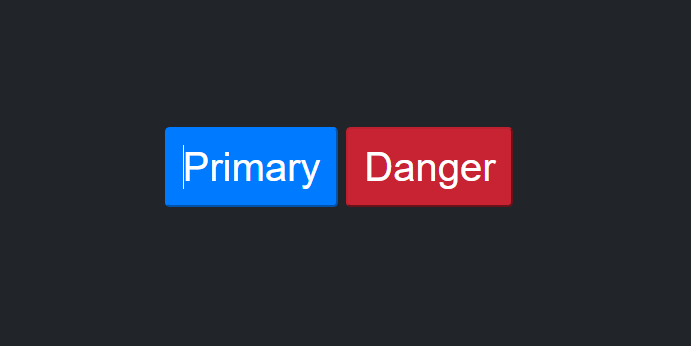

# Callback Javascript

A callback function is a function passed into another function as an argument, which is then invoked inside the outer function to complete some kind of routine or action.



Here is a quick example:

```js
const Button = (text, callback) => {
  const body = document.querySelector("div.group-btn")
  const button = document.createElement("button")
  button.textContent = text
  button.classList.add("btn-style")
  button.setAttribute("role", "button")

  callback(button)

  body.insertAdjacentElement("beforeend", button)

  return button
}
```

# Another examples

Dynamic content:

```js
Button("Primary", (button) => {
  button.style.cssText = `
    background-color: #007bff;
    border-color: #007bff;
  `
  button.setAttribute("aria-describedby", "primary alert button")

  button.addEventListener("click",() => {
    alert("Primary button click!")
  })
})
```

Promises e async/await Dynamic content:

We can use Promises and async/await to asynchronously load dynamic content and update the DOM based on the fetched data.

```js
const fetchData = () => {
  return new Promise((resolve, reject) => {
    setTimeout(() => {
      const data = "Dynamic content";
      resolve(data);
    }, 2000);
  });
}

async function renderDynamicContent() {
  try {
    const data = await fetchData();
    const title = document.querySelector("#title");
    title.textContent = data;
  } catch (error) {
    console.error("Error loading dynamic content:", error);
  }
}

renderDynamicContent();

```

Working with higher order functions and dynamic components:

We can use higher order functions to create custom dynamic components. Here is an example of a function that creates a dynamic form with input fields.

```js
const createDynamicForm = (fields, onSubmit) => {
  const form = document.createElement("form");

  fields.forEach((field) => {
    const input = document.createElement("input");
    input.type = field.type;
    input.placeholder = field.placeholder;

    form.appendChild(input);
  });

  const submitButton = document.createElement("button");
  submitButton.textContent = "Send";

  submitButton.addEventListener("click", (event) => {
    event.preventDefault();
    const formData = new FormData(form);
    onSubmit(Object.fromEntries(formData));
  });

  form.appendChild(submitButton);

  return form;
}

const formFields = [
  { type: "text", placeholder: "Name" },
  { type: "email", placeholder: "Email" },
  { type: "password", placeholder: "Password" },
];

const formContainer = document.querySelector("#form-container");

const myForm = createDynamicForm(formFields, (formData) => {
  console.log("Form data:", formData);
});

formContainer.appendChild(myForm);
```
<br/>

# Study reference

Below links for better understanding of the content.

## Editorconfig

EditorConfig helps maintain consistent coding styles for multiple developers working on the same project across various editors and IDEs.

Link: https://editorconfig.org/
<br>
Link (extension for vscode): https://marketplace.visualstudio.com/items?itemName=EditorConfig.EditorConfig
## Live Server (extension for Visual Studio code)

Launch a local development server with live reload feature for static & dynamic pages.

Link: https://marketplace.visualstudio.com/items?itemName=ritwickdey.LiveServer

## Element: insertAdjacentHTML() method

The insertAdjacentHTML() method of the Element interface parses the specified text as HTML or XML and inserts the resulting nodes into the DOM tree at a specified position.

Link: https://developer.mozilla.org/en-US/docs/Web/API/Element/insertAdjacentHTML

## CSSStyleDeclaration: cssText property

The cssText property of the CSSStyleDeclaration interface returns or sets the text of the element's inline style declaration only.

Link: https://developer.mozilla.org/en-US/docs/Web/API/CSSStyleDeclaration/cssText

## Element: classList property

The Element.classList is a read-only property that returns a live DOMTokenList collection of the class attributes of the element. This can then be used to manipulate the class list.

Link: https://developer.mozilla.org/en-US/docs/Web/API/Element/classList
